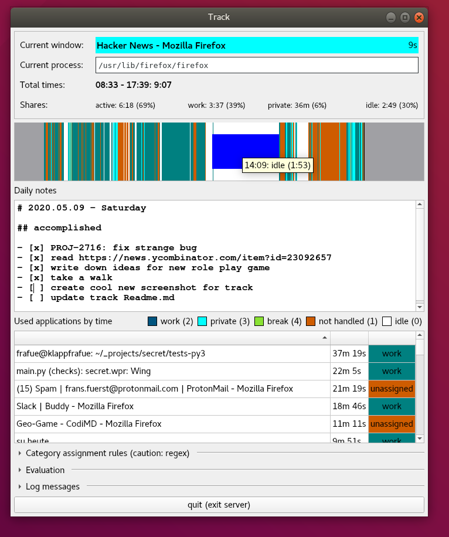

## track - automatic time tracker for computer work

Track logs your desktop active time and the applications you're using to 
create a time chart of your working day.

Unlike [KTimeTracker](https://www.kde.org/applications/utilities/ktimetracker/) 
or [Hamster](https://projecthamster.wordpress.com/about/) Track goes with
as little user interaction as possible. Once configured you just (auto)start it
and Track runs on it's own.

This is an early screenshot to give an idea of how Track works:

What it does:
* logs times your computer is active and which applications are in focus
* handles a list of rules which assign certain activities to private work

What it does not:
* manage an abstract task list you would have to maintain
* send any information to someone

When should you use track:
* in case you're working mainly on a computer like software developers
* if you want to know how long you've been at work today
* if you want to know how much of your private time you spent on the computer
* if you want to waste your time with another self profiling tool

The current project state is very early (see the [schedule](progress.md). Very 
basic features are still missing so it might be wise to come back in a week or 
so. 
However it's totally save to use the tool and it's providing some interesting 
information already.

### requirements

* Linux (Windows coming soon)
* Python 2.7 (Python 3 coming soon)
* PyQt4
* python-libwnck

### how to run

Just clone the repository and run `track.py`.

